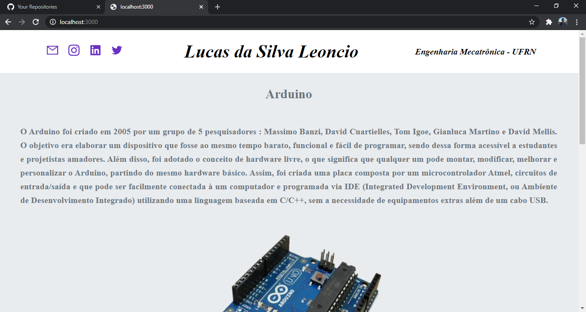
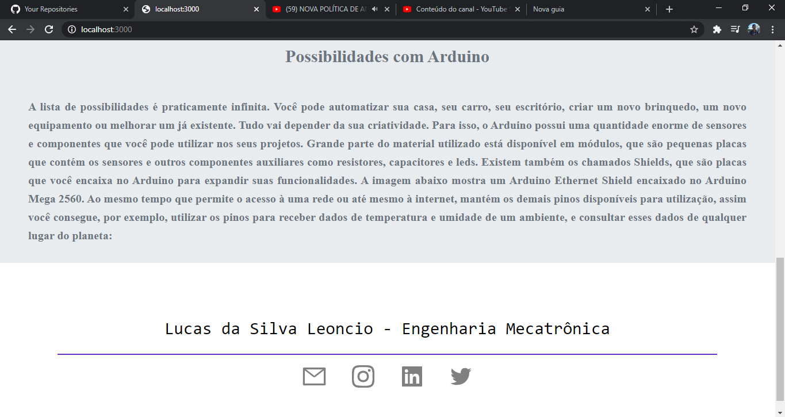

# :pencil2: Blog pessoal Utilizando Next Js. :computer:

## Este projeto consiste em produzir um blog simples usando Nextjs com algumas animações usando Framer-motion.

## O primeiro passo nessa construção foi formular a estilizar global do sistema. Em Next js para poder realizar esta ação é necessário criar o arquivo _app.js e importar o arquivo css que contém as estilizações. O Blog possui um sistema simples, por isso existe apenas um arquivo index.js que é a página principal. Nela contém três componentes Main, Header e o Footer. O componente Header é o cabeçalho do blog, não tem muitas coisas. Nele, o nome "Lucas da Silva Leoncio" e "Engenharia Mecatrônica", além das redes sociais. Além destes atributos, o nome "Lucas da Silva Leoncio" possui uma animação simples utilizando framer-motion.

## O arquivo Main.js possui as informações do blog. O texto e as imagens são para a ilustração. 

